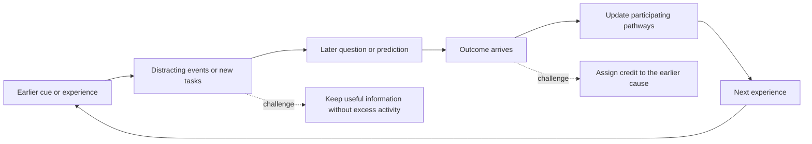
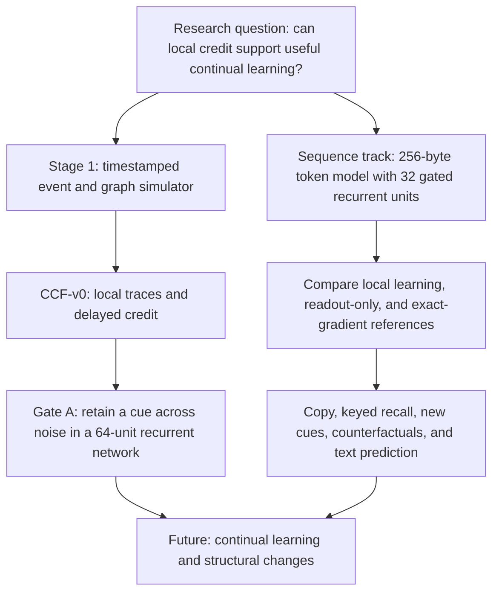
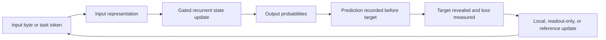

# Project guide: what this research is trying to do

This is an experimental Python research project, not a finished AI product. Its
goal is to test whether a small model can learn from a stream of experience,
remember information over time, and eventually adapt without Transformer
attention or a full backward pass through the whole sequence. The proposed
local learning rule is called **Causal Credit Flow (CCF)**. The experiments must
show an advantage over suitable baselines before the mechanism can be called
successful or novel.

## The problem, in one picture



For example, the model may see a value, process many unrelated tokens, and then
be asked to copy the value or recall a value associated with a key. A useful
system must keep the right information, answer an unfamiliar example, and learn
from an error without destroying earlier skills. The project also wants this to
be efficient on accessible hardware. These are **goals**, not demonstrated
capabilities.

## Two connected research tracks



The **Stage 1/CCF track** implements a fixed graph, local event traces, delayed
feedback, and experiments designed to falsify the credit rule. A clean,
constructed path worked, but the recurrent task did not. Gate A remains open.

The **sequence track** is a more direct attempt at token prediction. It has a
working CPU reference and CUDA implementation, a fixed sparse recurrent state,
and several controlled development studies. Its learning rules and comparisons
are research prototypes. Sparse connectivity does not mean event-sparse
execution: currently every unit updates for every token. The model does not
grow, prune, or rewire itself.

## How a sequence experiment works



The model's state persists between tokens and can be reset for a control test.
The local variant carries forward approximate eligibility information and sends
an error signal to participating parameters. The exact-gradient/BPTT variant is
a diagnostic reference for the same recurrence: it helps separate a weak
learning rule from a weak representation. It is not the proposed final learning
method. The tests compare performance with state intact versus reset, with
fresh distractors, with unseen cues, and after changing the correct answer.

## What the evidence currently says

| Test | Observed result | Meaning |
| --- | --- | --- |
| Recurrent CCF development task | 0.482 accuracy for CCF, 0.482 without trace, 0.484 random | No measured advantage on the delayed recurrent task. |
| Gate A memory candidates | Radius sweep, slow-state, and A3 readout trace ended `NO_SELECTION`; best A3 candidate passed 3 of 7 retention gates | No approved memory repair. Confirmatory work stays closed. |
| Small held-out text | Local core 3.7215 nats/byte; bigram 3.4888 (lower is better) | The sequence model did not beat a simple bigram baseline. |
| First copy/recall memory study | Copy exact 0.13% and recall 12.37% for local learning | Around simple guessing references; state reset had little average effect. |
| Tiny training set | Exact-gradient reference fit 7/8 cells; original local rule fit 0/8 | The recurrence can fit small examples, while the original local rule struggled. This does not show generalization. |
| Diverse-cue development candidate | Final novel-cue exact 10.94% copy and 37.50% recall; paired novel/changed-cue 3.91% copy and 10.94% recall | Better than earlier development conditions, but still unreliable on new answers and value changes. |
| Frozen checkpoint probe | Copy value probe 82.55% just after cue, 46.09% after distractors | Information accessible to a diagnostic readout decays during the delay. |

The binding probe uses privileged diagnostic heads and must not be interpreted as
the native model's task accuracy. Different experiments use different data and
conditions, so the rows above are not one benchmark leaderboard. See
[sequence progress](SEQUENCE_PROGRESS.md) and
[canonical status](CANONICAL_STATUS.md) for definitions, complete conditions,
and terminal evidence. The official research-readiness rubric remains **21/100**;
that number is a project evidence score, not a probability of success.

## Why progress is blocked

1. **Memory and binding:** earlier information often becomes hard to recover
   after distracting tokens. For recall, the latest probe also points to weak
   encoding or binding of a key to its value.
2. **Credit assignment:** the original local update is much weaker than an exact
   direction on a measured event graph, and it fails to fit small cases that an
   exact-gradient reference can fit. Newer local/Adam variants improve selected
   development cases but do not yet solve unseen, changed answers.
3. **Generalization:** fitting repeated examples or noise can look impressive
   while performance collapses when distractors, cues, or values change.
4. **Evidence gates:** no memory candidate passed all registered Gate A criteria.
   The older A3 and LWOH-L1 V2 source freezes also precede integrity repairs;
   a new official run needs its own prospective freeze. Passing software tests
   alone cannot open the research gate.
5. **Comparison gap:** there is no matched tiny Transformer or state-space
   benchmark yet, nor evidence of autonomous topology changes, continual
   retention, or a competitive language model.

These are measured research limitations. They do not imply that every idea in
the project is impossible, nor that more training alone will fix them.

## Repository map

```text
LifelongLearningProject/
├── README.md                    Mission, historical results, run examples
├── docs/
│   ├── PROJECT_GUIDE.md         Start here: concepts, diagrams, status, map
│   ├── CANONICAL_STATUS.md      Machine-derived official Gate A status
│   ├── SEQUENCE_PROGRESS.md     Chronological sequence research results
│   ├── RESEARCH_READINESS_90.md Evidence rubric and longer route
│   ├── CCF_V0.md                Original local-credit equations
│   ├── EXPERIMENT_*.md          Frozen protocols and result notes
│   └── SEQUENCE_*.md            Sequence protocols and target
├── src/adaptive_learning_substrate/
│   ├── events.py, graph.py, recurrent.py, learning.py
│   │                            Stage 1 simulator and CCF implementation
│   ├── experiment_000*.py       Stage 1 runners, controls, audits
│   ├── sequence_core.py, sequence_cuda.py
│   │                            CPU and CUDA token-sequence engines
│   ├── sequence_credit.py, sequence_memory.py,
│   │   sequence_diversity.py, sequence_binding_audit.py
│   │                            Sequence learning and diagnostic runners
│   └── artifact_validation.py   Evidence and official-status validation
├── tests/                      Software behavior and provenance checks
├── configs/                    Run settings and experiment schedules
├── .github/workflows/          CI quality checks
├── artifacts/                  Local experiment outputs; Git ignored
└── runs/                       Local run outputs; Git ignored
```

The repository tracks source, tests, configs, and documents. `artifacts/` and
`runs/` are intentionally ignored by Git, even if they exist on this machine.
Their large files and integrity sidecars may be needed locally to reproduce
recorded status. Moving or renaming frozen protocols, evidence files, or source
snapshots can invalidate hash and path bindings. The map above organizes the
project by purpose without changing those paths.

## A sensible next experiment

Register one bounded memory-retention change for copying, then compare it on
fresh development seeds against the unchanged fixed-feedback model and an
unchanged-recurrence training-budget control. Keep the diverse cue, noise, and
counterfactual tests; report native task accuracy as well as state probes.
Investigate recall encoding and key/value binding separately. Only after those
behaviors work should a broader text corpus and matched tiny recurrent,
Transformer, and state-space comparisons support a replacement claim. Official
Gate A requires a fresh source freeze before any new official metrics.

## Running and checking the project

From the repository root, install the package with test dependencies, then run
the software checks:

```powershell
python -m pip install -e ".[test]"
python -m ruff check src tests
python -m pytest -q -p no:cacheprovider
python -m adaptive_learning_substrate.artifact_validation verify
```

If using the source tree without an editable install, set `$env:PYTHONPATH='src'`
first, including for tests that launch child Python processes. On Windows, a
short writable pytest temporary path can avoid long-path failures; for example,
add `--basetemp C:\Users\Yash\als_pytest_temp` to the pytest command. The
artifact verifier reads local ignored evidence files, so a fresh clone without
those files cannot reproduce the complete local evidence check. Running tests
checks software behavior; it does not turn failed research metrics into passes.

For more document navigation, see the [documentation index](README.md).

## How to explain this project in one minute

> We are testing whether a small recurrent AI model can remember useful
> information and learn from delayed outcomes using mostly local updates. The
> code and experiments are real, but the central research claim has not passed:
> the original recurrent learner is near chance, and newer models still struggle
> with unfamiliar or changed examples. Our tests show where information is lost
> and where the learning signal is weak. The next step is a controlled memory
> change, followed by fair comparisons with existing small models.
